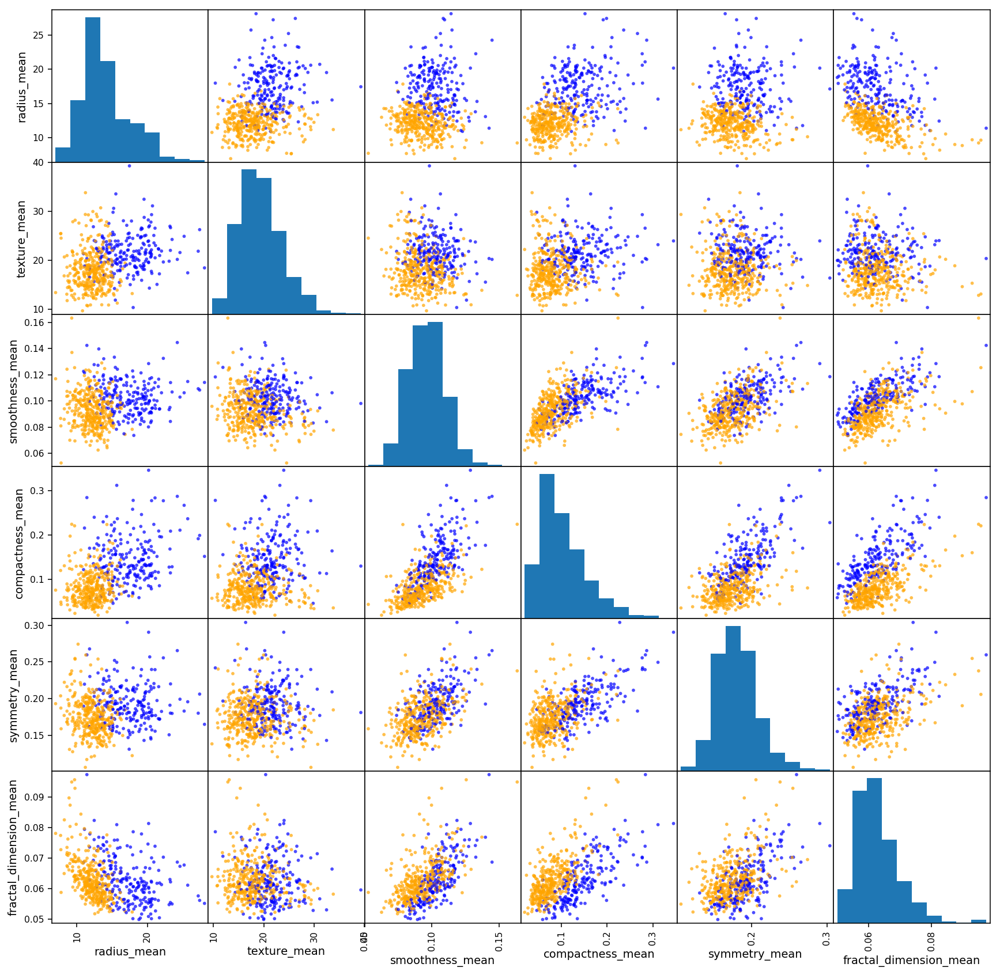
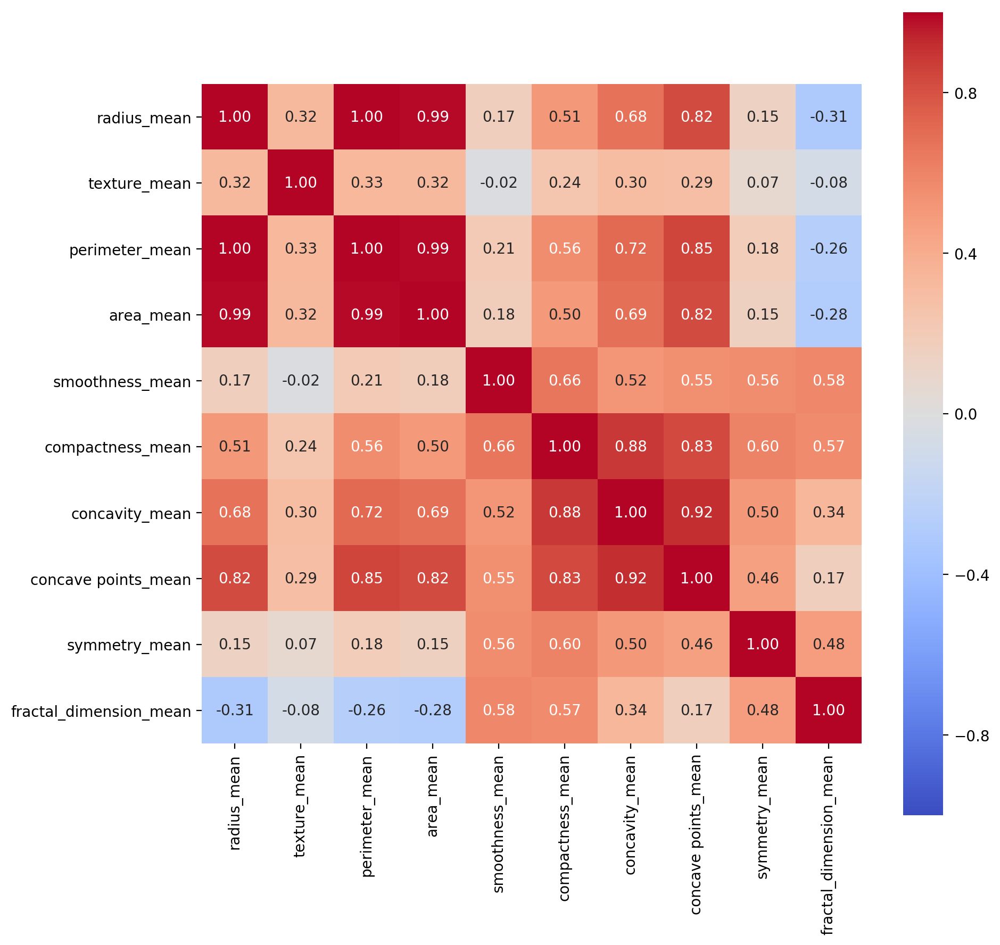
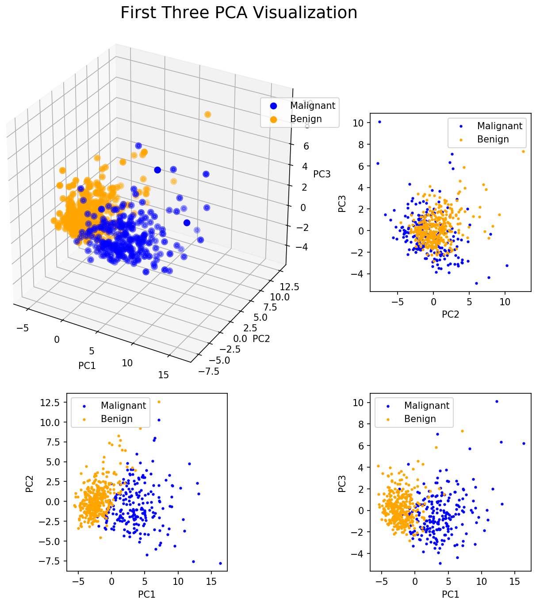
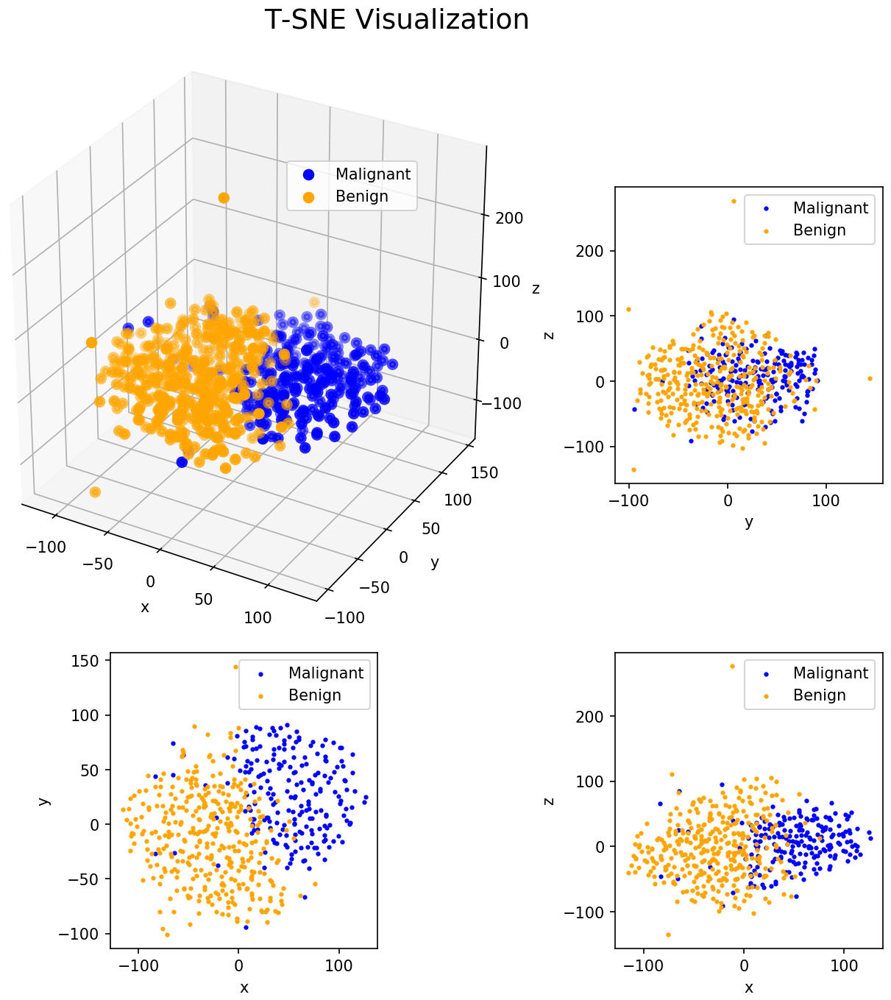
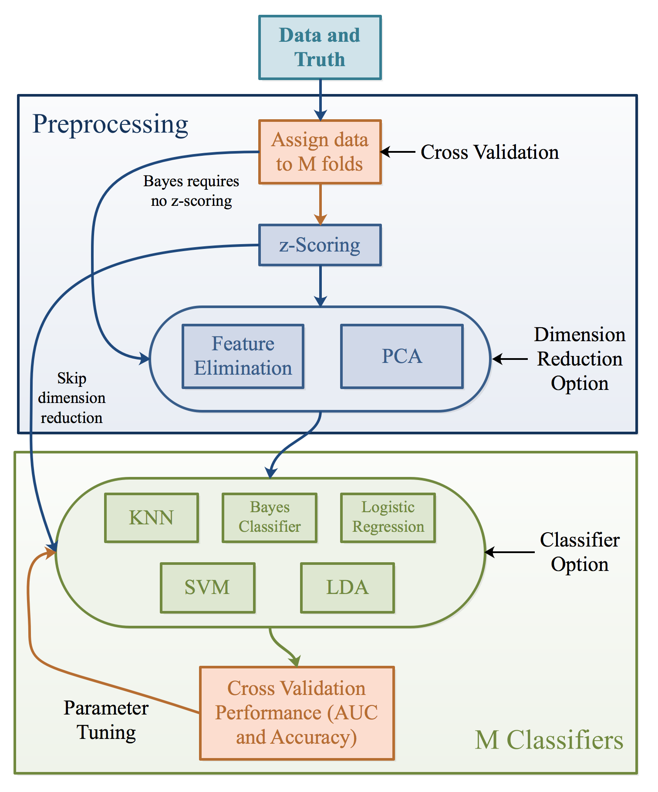
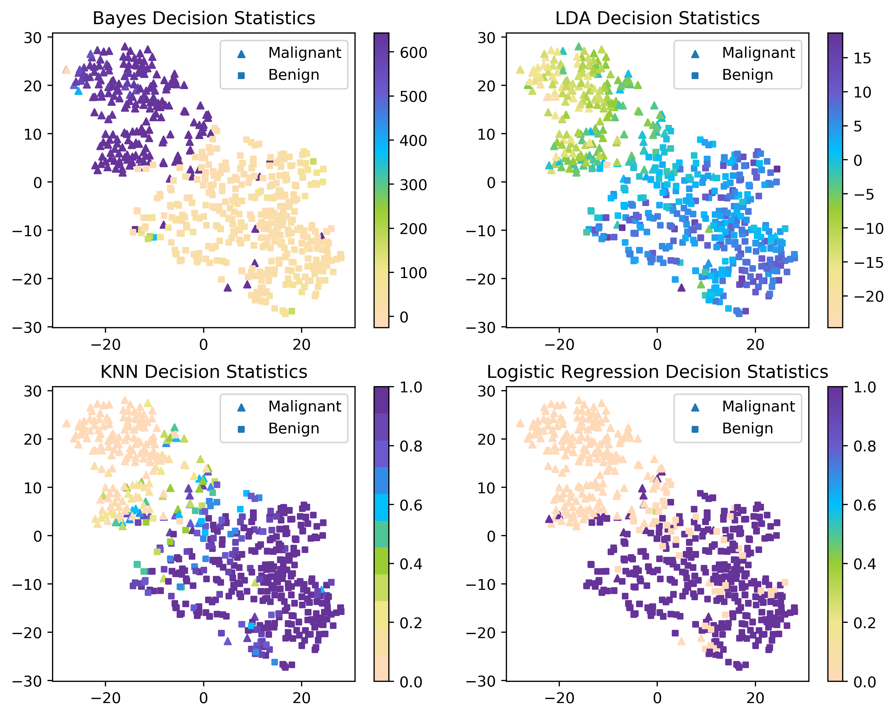
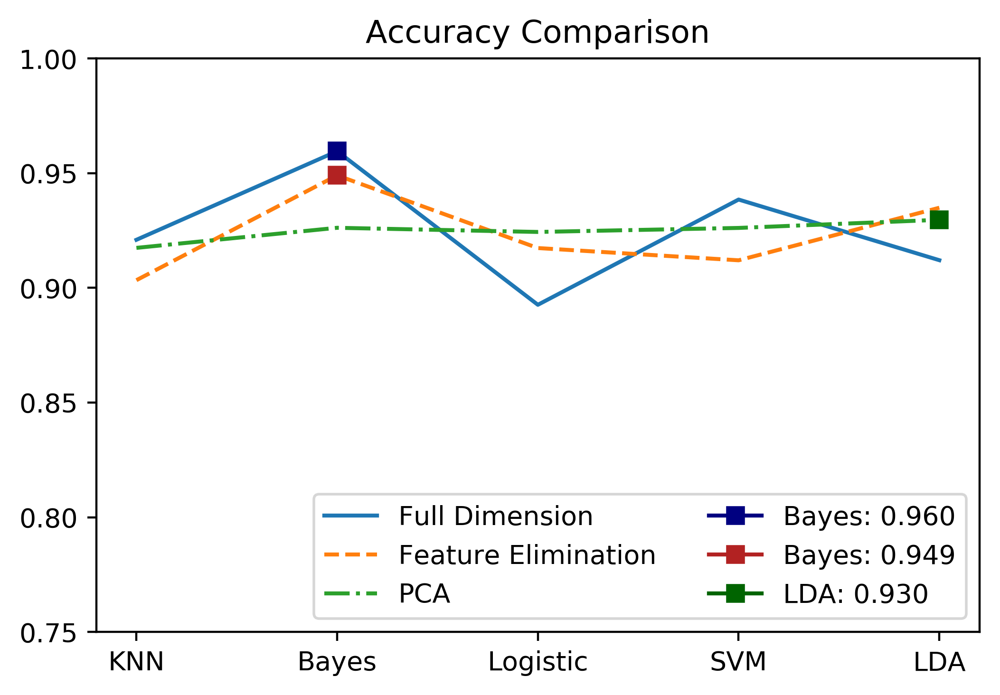

# breast_cancer_prediction

> Classify breast cancer subtypes using [Breast Cancer Wisconsin Dataset](https://archive.ics.uci.edu/ml/datasets/Breast+Cancer+Wisconsin+(Diagnostic)). Cancer classification historically requires prior biological knowledge. However, most machine learning engineers lack biological background. Prediction models with high accuracy are aimed to aid oncologists with diagnosis and prognosis. Apart from achieve high accuracy, the goal of this project is to generate comprehensive data analysis that helps with identifying a suitable classifier.

## Data

The data contains 569 samples in total with two classes: malignant cells and benign cells. The original image provides 10 characteristics for each sample: radius, texture, perimeter, area, smoothness, compactness, concavity, concave points, symmetry and fracture. The mean value, standard error, and mean of the three largest values are calculated from the original data, respectively, for each data sample. Therefore, 30 features are generated for each sample.

## Visualizations (EDA)

### Pairwise Plot

### Correlation Heatmap

### 3D PCA Analysis

### 3D T-SNE Analysis

## Algorithmic Pipeline

## Model Evaluation

### Decision Surface

### Accuracy Comparison

## Docs

A comprehensive report is available [here](https://ziyuan-shen.github.io/files/breast_cancer_prediction_report.pdf).